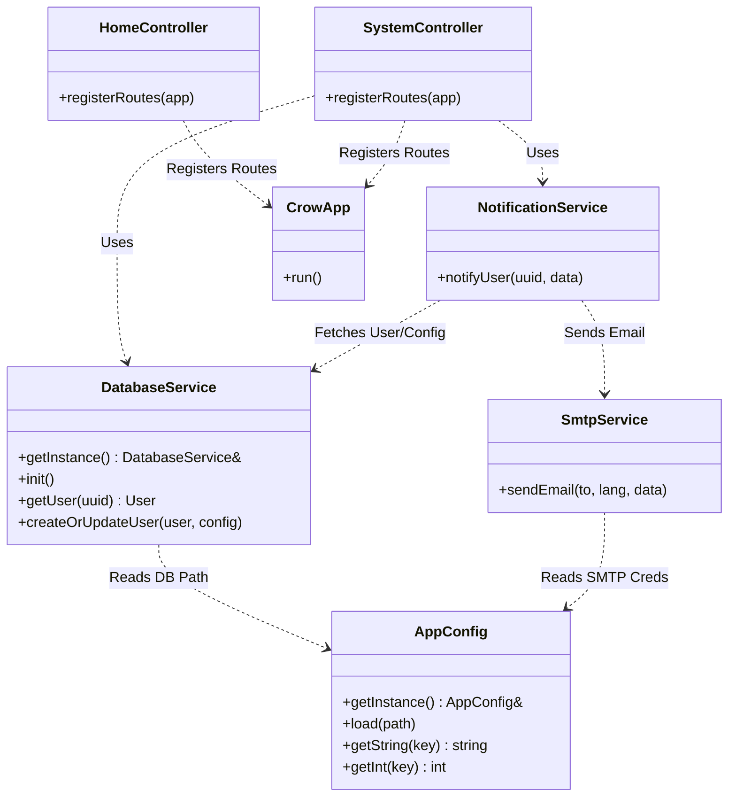
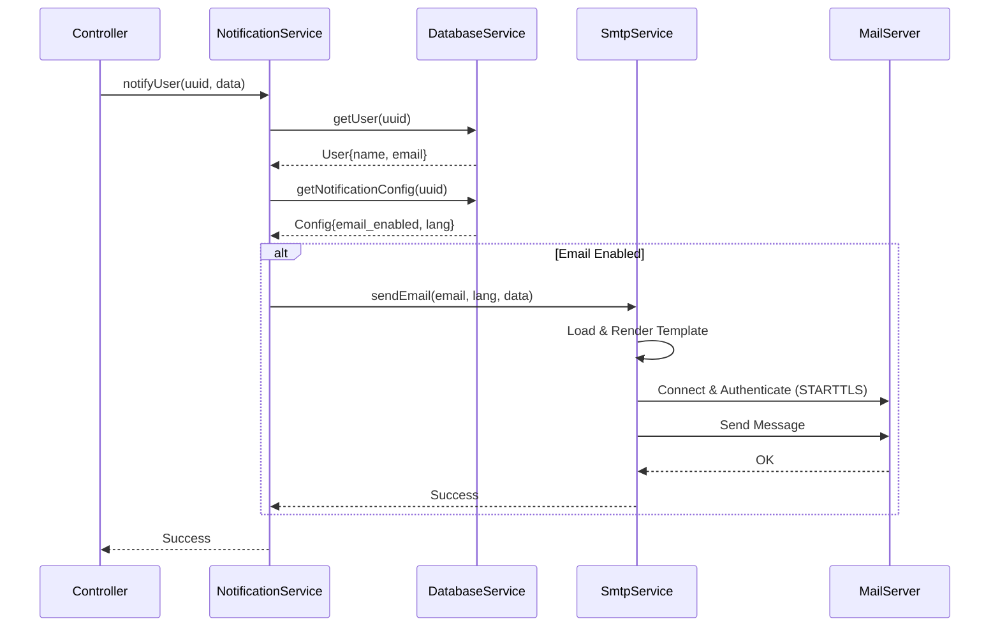

<div id="top" align="center">
<h1>CPP App Server (Crow Framework)</h1>

<p>C++23 Crow template project.</p>

[Report Issue](https://github.com/Zheng-Bote/Crow_CPP_Template/issues) · [Request Feature](https://github.com/Zheng-Bote/Crow_CPP_Template/pulls)

[](https://choosealicense.com/licenses/mit/)
[](https://github.com/Zheng-Bote/Crow_CPP_Template/releases)

</div>

---

<!-- START doctoc generated TOC please keep comment here to allow auto update -->
<!-- DON'T EDIT THIS SECTION, INSTEAD RE-RUN doctoc TO UPDATE -->
**Table of Contents**

- [Description](#description)
- [🚀 Features](#-features)
- [🛠 Dependencies](#-dependencies)
- [⚙️ Prerequisites](#-prerequisites)
- [🏗️ Build & Run](#-build--run)
- [📝 Configuration](#-configuration)
- [📡 API Documentation](#-api-documentation)
- [📐 Architecture](#-architecture)
  - [Directory Structure](#directory-structure)
  - [Class Diagram (Mermaid)](#class-diagram-mermaid)
  - [Notification Workflow](#notification-workflow)
- [📜 License](#-license)
- [Authors](#authors)

<!-- END doctoc generated TOC please keep comment here to allow auto update -->

---

## Description


A modern, high-performance C++23 Web Server template based on the Crow framework. This project demonstrates a clean, layered architecture (MVC) suitable for building scalable REST APIs and web applications. It includes built-in services for Database interaction (SQLite), Email notifications (SMTP/Inja Templates), and comprehensive Logging (Spdlog).

## 🚀 Features

- **Modern C++23**: Utilizes the latest C++ standards.
- **Web Framework**: Powered by [Crow](https://github.com/CrowCpp/Crow) for fast routing and HTTP handling.
- **MVC Architecture**: Strict separation of concerns (Controllers, Services, Models/DTOs, Utils).
- **Database**: SQLite integration via `sqlite3` with a thread-safe singleton wrapper.
- **Email Service**: SMTP client (via `mailio`) with HTML templating support (via `inja`).
- **Configuration**: Environment variable management using `.env` files (via `dotenv-cpp`).
- **Logging**: High-performance logging with `spdlog` (Console + Rotating File Sinks).
- **JSON Support**: Integrated `nlohmann/json`.

## 🛠 Dependencies

This project uses `CMake`'s `FetchContent` to manage dependencies automatically. No manual installation is required for libraries.

- **Crow**: C++ Microframework for Web.
- **nlohmann/json**: JSON for Modern C++.
- **spdlog**: Fast C++ logging library.
- **sqlite3**: C-language library that implements a SQL database engine.
- **mailio**: C++ MIME library and SMTP client.
- **inja**: Template engine for modern C++.
- **dotenv-cpp**: Load environment variables from .env files.
- **Boost.Asio / OpenSSL**: Required for networking and SSL/TLS.

## ⚙️ Prerequisites

- **C++ Compiler**: GCC 13+ or Clang 16+ (Must support C++23).
- **CMake**: Version 3.28 or higher.
- **OpenSSL**: Development libraries (e.g., `libssl-dev`).
- **SQLite3**: Development libraries (e.g., `libsqlite3-dev`).

## 🏗️ Build & Run

1.  **Clone the repository**

    ```bash
    git clone <repository_url>
    cd Crow_CPP_Template
    ```

2.  **Configure the project**

    ```bash
    cmake -S . -B build
    ```

3.  **Build**

    ```bash
    cmake --build build -j$(nproc)
    ```

4.  **Run**
    Make sure the `.env` file exists in `data/CPPAppServer.env` (or configure your path).
    ```bash
    ./build/CPPAppServer
    ```

## 📝 Configuration

The application is configured via a `.env` file located in `data/CPPAppServer.env`.

**Example `.env`:**

```ini
# Server Configuration
SERVER_PORT=8080
SERVER_THREADS=0  # 0 = Auto-detect
SERVER_JWT_SECRET=ChangeMeToSomethingSecure

# Admin User Setup (Auto-created on test route)
SERVER_ADMIN_NAME="Admin User"
SERVER_ADMIN_EMAIL="admin@example.com"
SERVER_ADMIN_PASSWORD=Secret!

# SMTP Configuration
SMTP_SERVER="smtp.example.com"
SMTP_PORT=587
SMTP_USERNAME="mailer@example.com"
SMTP_PASSWORD="MailPassword"
SMTP_FROM="mailer@example.com"
SMTP_STARTTLS=true
MAIL_TEMPLATE_DIR="./data/templates"

# Filesystem / Logging
LOG_DIR=./data/logs
LOG_LEVEL=info
DB_DIR=./data/db/app.sqlite
UPLOAD_DIR=./data/uploads
```

## 📡 API Documentation

| Method  | Endpoint               | Description                                                                        |
| :------ | :--------------------- | :--------------------------------------------------------------------------------- |
| **GET** | `/`                    | Returns application name, version, and status.                                     |
| **GET** | `/status`              | Simple health check (Returns 200 OK).                                              |
| **GET** | `/system/health_check` | Returns detailed status and server timestamp.                                      |
| **GET** | `/system/system_info`  | Returns full project info, version details, and build environment.                 |
| **GET** | `/system/test_email`   | **Debug**: Creates a test user and sends a system info email to the admin address. |

## 📐 Architecture

The project follows a modular Layered Architecture.

### Directory Structure

- `include/` - Header files (Interfaces).
- `src/` - Implementation files.
  - `controllers/` - Handle HTTP requests and map them to service logic.
  - `services/` - Business logic, DB access, External APIs (SMTP).
  - `utils/` - Helper classes (Config, Logging).
- `data/` - Runtime data (Config, DB, Logs, Templates).

### Class Diagram (Mermaid)



### Notification Workflow

1.  **Trigger**: A controller (e.g., `SystemController`) calls `NotificationService::notifyUser(uuid, payload)`.
2.  **Fetch Data**: `NotificationService` queries `DatabaseService` to get the user's email and notification preferences (enabled? language?).
3.  **Prepare**: If enabled, the service prepares the payload (injecting user name, etc.).
4.  **Send**: `SmtpService` is invoked.
    - Loads the correct HTML template (based on language) via `inja`.
    - Renders the template with the payload.
    - Connects to the SMTP server (using `mailio` with `STARTTLS`).
    - Sends the email.



---

## 📜 License

This project is licensed under the MIT License - see the LICENSE file for details.

---

## Authors

[](https://www.github.com/Zheng-Bote)

**Copyright:** © 2026 ZHENG Robert

---

:vulcan_salute:

<p align="right">(<a href="#top">back to top</a>)</p>
